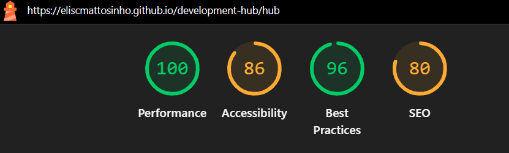

# Development Hub


## 📝 Project description

**Development Hub** is a professional-grade task management orchestrator built with **React 19**. It moves away from traditional static Kanban structures by implementing a **Domain-Driven Projection** engine, allowing users to visualize the same data truth through different methodological lenses (Scrum or Kanban).

### Core engineering features

- **Hybrid projection engine:** Seamlessly switch between Scrum and Kanban views where cards are dynamically mapped to columns based on semantic status.
- **Triple domain separation:** Strict separation of concerns between Card (Truth), Column (Structure), and Board (Orchestration).
- **Context-Aware Hooks:** Optimized state management following the "Golden Rule": components request data directly from context, eliminating prop drilling.
- **Clean-Slate policy:** Automated storage reset on reload to ensure a consistent, "factory-fresh" experience for demonstration and portfolio review.
- **Zero-backend persistence:** Utilizes an advanced service layer to manage `sessionStorage` with defensive programming against data corruption.

⚠️ **Note:** This project is designed as a high-level engineering showcase. Data is transient by design to facilitate rapid testing of different board templates.

<br />

## 📊 Performance & Quality (Lighthouse)

The project was audited using Google Lighthouse, achieving a good score in Performance. This reflects the efficiency of the **Domain-Driven Projection** architecture, which minimizes unnecessary re-renders even with heavy client-side data manipulation.

### Lighthouse audit results

| Desktop version | Mobile version |
| :---: | :---: |
|  |  |
| **Mode:** Navigation | **Mode:** Navigation |

### Key metrics

- **Performance:** 100/100 (Initial render in < 0.5s)
- **Best practices:** 96/100
- **SEO & Accessibility:** Optimizations in progress to reach a full "Green Score" across all categories.

<br />

## 📚 Technical documentation

To understand the core engine and the logic behind the "Limbo Prevention" and "Mirroring", refer to the guides:

- **[System architecture](./docs/architecture.md)**: Details on the Projection-Based Responsibilities and Domain layers.
- **[Best practices & Standards](./docs/best-practices.md)**: Smart Hooks, Memoization patterns, and the Responsibility Matrix.
- **[System workflows](./docs/workflows.md)**: Lifecycle of card projection, mirroring, and the Clean-Slate reload logic.

<br />

## 🛠️ Technologies used


### Core implementation details:

- **React 19:** Utilizing Context API, Custom Hooks, and Portals for the modal engine.
- **React Router 7:** `Basename` and Route Boundaries for GitHub Pages compatibility.
- **UI/UX:** Enhanced feedback with `React Toastify` and unified iconography via `React Icons`.
- **Deployment:** CI/CD pipeline using the `gh-pages` utility.

<br />

## 🖼️ Screenshots & Demos

- **Live demo:** [Access application](https://eliscmattosinho.github.io/development-hub/)
- **Design showcase:** [Behance gallery](https://www.behance.net/gallery/231328777/Development-Hub-Task-Management-Experience)
- **Derived from the case:** [Digital Reading Ecosystem](https://eliscmattosinho.notion.site/Ecossistema-de-leitura-digital-15432edc5fc5805a8ecfe3447f2d3d0b)
  - **Landing page:** [Skeelo-Skoob Epics](https://eliscmattosinho.github.io/lp-skeelo-skoob-epics/)

<br />

## 🚀 Roadmap & Future improvements

This project is a living organism. Below are the implementations planned for upcoming versions:

### 1. Drag & Drop engine (high priority)

- **Goal:** Implement visual movement of cards between columns and internal reordering.
- **Technical approach:** Utilization of the `dnd` library integrated with the `CardContext`. The logic will involve real-time updates of the card's `status` and `index` within `sessionStorage` upon component collision.

### 2. Accessibility & A11Y compliance

- **Goal:** Reach a 100/100 score on Lighthouse Accessibility and ensure WCAG 2.1 compatibility.
- **Technical approach:** Implementation of **ARIA Landmarks**, keyboard navigation for all interactive elements (Focus Trap on modals), and semantic contrast adjustments.

### 3. Advanced filtering & Tags

- **Goal:** Develop a global search system and filtering by priority or labels within both Scrum and Kanban boards.

<br />

## 🏗️ Deployment & Installation

The project is automated for GitHub Pages. To run locally or deploy manually:

```bash
# Install dependencies
npm install

# Run development server
npm run dev

# Build and Deploy
npm run deploy
```
