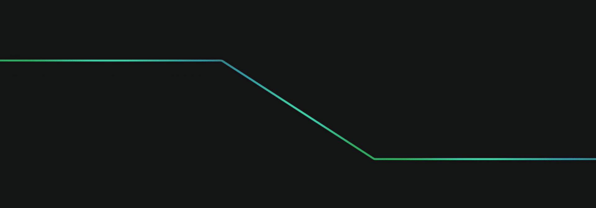

# Development Board

## Project Description

?

- Notion case: [Development Board | Notion](https://eliscmattosinho.notion.site/Ecossistema-de-leitura-digital-15432edc5fc5805a8ecfe3447f2d3d0b).

## Screenshots

- Project on Behance: [Development Board | Behance](https://www.behance.net/gallery/231328777/Development-Board).

## Technologies used

- React 19
- React Router Dom 7
- React Icons
- JavaScript (ES6+)
- CSS3
- GitHub Pages (deploy)

## Deployment

?

You can access the live application here:

- [Live Demo](https://eliscmattosinho.github.io/Board-de-Desenvolvimento/)

 

